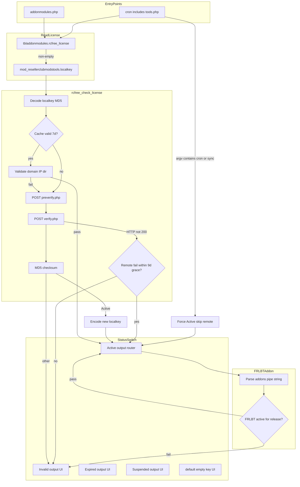
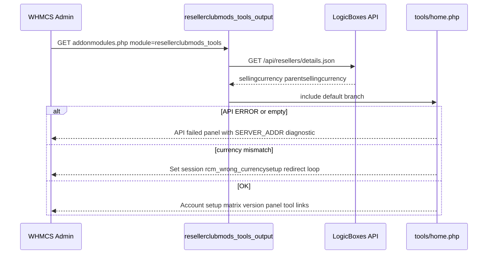
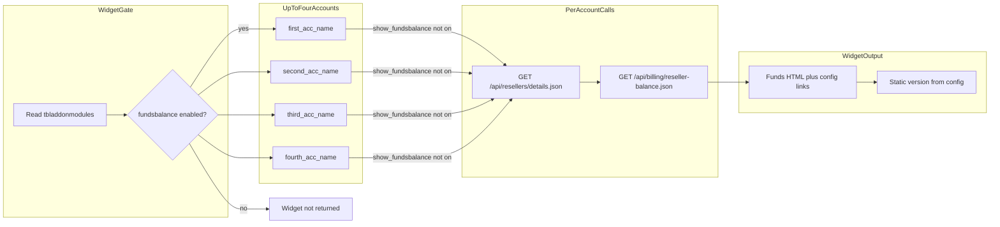
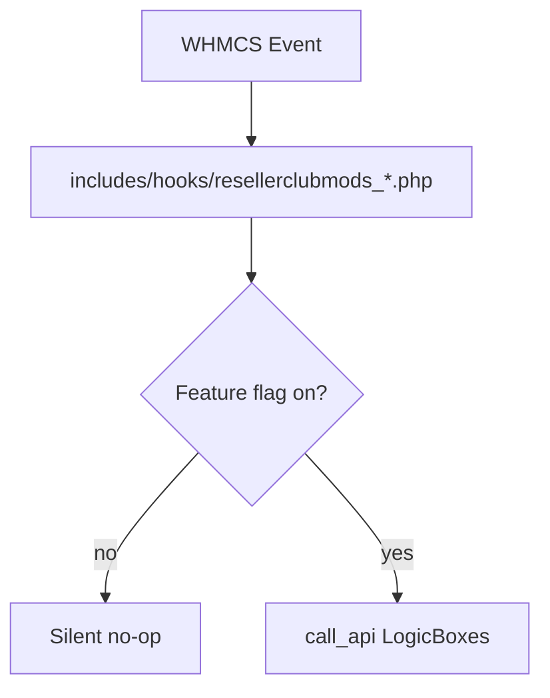

# Architecture Diagrams

Mermaid diagrams for RC & LB Tools v2.19.1. Node IDs use camelCase; edge labels with special characters are quoted.

## License validation flow

**Cross-reference:** Cron argv bypass at `resellerclubmods_tools.php:210-211`. Widget path does **not** appear in this diagram—it skips `rcfree_check_license()` entirely (see Widget diagram).

## Admin home load sequence (post-OSS)

**Evidence:** API test in `resellerclubmods_tools_output()`; IP diagnostic from `$_SERVER` in `home.php`; currency loop in `home.php`.

## AdminHomeWidget API calls

**Important:** Widget is gated on `fundsbalance` config only; no license or remote version check.

## Hook event fan-out

## Diagram ↔ gate matrix cross-walk

| Diagram node | Gate matrix row |
|--------------|-----------------|
| `ForceActive` | Main bootstrap cron bypass; cron scripts |
| `KeyPresent` | AdminHomeWidgets |
| `Active output router` | Active case + inherited tools |
| `Invalid` / `Expired` / `Suspended` | Matching switch cases |
| Hook `LicGate` | 10 `includes/hooks` files |
| `domainpricelist` | Not in these diagrams—see gate matrix widget row |
