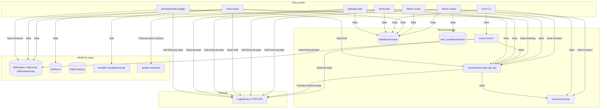

# System map & cross-component dependency analysis

**Product:** `resellerclubmods_tools` RC & LB Tools **v2.19.3**  
**Scope:** This distributable package only (addon + root hooks + cron + widget + standalone tools).  
**Not in repo:** payment gateways, provisioning/server modules, registrar modules, themes/orderforms, WHMCS core.

Evidence order for intended behavior: code/call sites → activate/upgrade schema → addon config Descriptions → `docs/` + AGENTS.md → WHMCS/LB docs. Prefer fail-closed security where docs overstate controls.

---

## 1. Component inventory (discovered)

| ID | Component | Path(s) | Entry |
|----|-----------|---------|-------|
| A | Admin addon router | `modules/.../resellerclubmods_tools.php` | `addonmodules.php?module=resellerclubmods_tools` |
| B | Addon hooks | `modules/.../hooks.php` | WHMCS loads addon `hooks.php` |
| C | Root hooks (10) | `includes/hooks/resellerclubmods_*.php` | WHMCS auto-loads on events |
| D | Shared libs | `incs/{functions,security,pagination,whoislookup,idnclass}.php` | Required by A/B/C/E/F/G |
| E | Cron CLI | `cron/resellerclubmods_{dompricesync,transfercheck}.php` | `php -q … [reseller_id]` only (HTTP 403) |
| F | Runners | `incs/runners/{dompricesync,transfercheck}_runner.php` | Included by E or admin CSRF path |
| G | Standalone HTTP | `tools/whois.php`, `tools/authlogin.php` | Direct HTTP under WHMCS |
| H | Client widget | `widgets/domainpricelist.php` | Client order-form JS include |
| I | Admin tool pages | `tools/*.php` (included by A) | Query-routed from `output()` |
| J | Custom tables | `mod_resellerclubmods{tools,funds,promo,raa,transfer}` | Capsule via activate/upgrade |
| K | WHMCS native tables | `tbladdonmodules`, `tbldomains`, `tblpricing`, `tbldomainpricing`, `tblclients`, `tblpromotions`, `tblemailtemplates`, … | Read/write by hooks/tools |
| L | LogicBoxes API | External HTTPS via `call_api()` | TLS verify on |
| M | Mail / localAPI | `adminemailmessages()` → `localAPI(sendadminemail)` | Threshold / transfer emails |
| N | AutoAuth | `dologin.php` + `$autoauthkey` | Consumed by authlogin |

---

## 2. Dependency graph (evidence-based)

Edge legend:

| Label | Meaning |
|-------|---------|
| **Hard** | B must load/succeed for A to function |
| **Soft** | A degrades if B fails/disabled |
| **Data** | Shared DB/session/credential state |
| **Event** | WHMCS hook / DailyCronJob ordering |
| **Ordering** | Install/load sequence constraint |
| **Temporal** | Runtime timing / cache freshness |
| **Contract** | Function/schema/config name must stay stable |
| **External-state** | LB API / AutoAuth / mail side effects |

### Edge table (selected high-signal)

| From → To | Class | Mandatory? | If B fails / disabled |
|-----------|-------|------------|------------------------|
| All PHP → `functions.php` / `security.php` | Hard / Contract | Yes | Fatal include or missing helpers |
| Root hooks → `tbladdonmodules` | Data / Ordering | Soft | Hooks no-op or skip when flags empty |
| Admin `output()` → `mod_resellerclubmodstools` | Data | Soft→Hard for tools | Empty tools UI / API errors |
| Admin/cron → `call_api` → LB | External-state | Soft | ERROR structure; callers must gate with `rcm_api_ok` |
| Dompricesync runner → `tbldomainpricing`/`tblpricing` | Data / External-state (WHMCS $) | Yes for sync job | Partial catalog write — interrupt risk |
| Transfercheck → `tbldomains` + mail | Data / Soft Mail | Soft | Status stuck / no email |
| Client hooks → LB customer APIs | External-state | Soft per `*_hook_*` | WHMCS client OK; LB out of sync |
| Funds widget / fundthreshold → LB balance | Soft External-state | Soft | Widget error / no threshold mail |
| Authlogin → LB token + AutoAuth | External-state / Contract | Fail-closed | Redirect home; no SSO |
| Whois → `wid_key` + LB domaincheck | Contract / Soft | Fail-closed | Unauthorized / unknown |
| Widget → pricing tables + session cache | Data / Temporal | Soft | Stale or empty prices |
| Promo DailyCronJob (prio 2→3) → `mod_resellerclubmodspromo` + `tblpromotions` | Event / Data | Soft | Promo prices drift |
| Domainrecurring DailyCronJob (prio 1) → `tbldomains.recurringamount` | Event / Data | Soft | Recurring amounts stale |

---

## 3. Shared-state audit

| State | Owner (write authority) | Readers | Writers | Notes |
|-------|-------------------------|---------|---------|-------|
| `tbladdonmodules` (module=`resellerclubmods_tools`) | WHMCS admin config UI + `resellerclubmods_tools_config()` | All hooks, cron, whois, authlogin, widget, admin | Config save; rare tool inserts for 2nd–4th account activate | **Canonical credentials** (`*_rcauth_apikey`) |
| `mod_resellerclubmodstools` | Admin account switch / config seed | Admin `output()` | Account switch, config insert | Account selection only; `rcauth_password` cleared as of 2.19.3 (no API-key denorm) |
| `mod_resellerclubmodsfunds` | `fundthreshold` hook | Same hook | Insert/update threshold snapshot | Unique `reseller_id` (upgrade) |
| `mod_resellerclubmodspromo` | Promo hooks + managepromos + price sync | Import pricing, promo hooks, widget | Promo activate/update, price sync | Index `(relid,type)` |
| `mod_resellerclubmodsraa` | RAA tool + raadomainreport | RAA UI | Resend/count updates | Index `domain` |
| `mod_resellerclubmodstransfer` | Transfercheck runner/tool | Transfercheck | Status flags per domainid | PK `domainid` |
| `tbldomainpricing` / `tblpricing` | Dompricesync runner, importdompricing, tldmanage, promo hooks | Widget, domainrecurring, client cart | Price sync / admin tools / promo | **Financial catalog** |
| `tbldomains` | Transfercheck, tldmanage, move tools, domainrecurring | Sidebar, RAA, import | Status/registrar/recurring/move | Ops + recurring $ |
| `tblclients` | Client sync hooks, import/export, move | Move/domain tools | Signup/modify/delete sync | PII |
| `tblpromotions` | promoactivate / promoupdate | WHMCS cart | DailyCronJob | Promo $ |
| `$_SESSION['rcm_*']` | Admin tools / widget | Same request lifecycle | serialize→**json** cache helpers | Object-injection class risk mitigated |
| Reseller API keys | Operator via addon config | `call_api` callers via vars/`rcm_account_apikey` | Config only | Never log; never copy to mod table |
| `$autoauthkey` | WHMCS `configuration.php` | authlogin | WHMCS only | Contract external |

---

## 4. Cross-component invariants (from this codebase)

1. **Credential source of truth** is `tbladdonmodules` `*_rcauth_apikey`, not `mod_resellerclubmodstools.rcauth_password` (cleared on upgrade/account switch).
2. **`call_api` is the only LB HTTP door** — TLS verify on; failures return `status=ERROR` (fail-closed callers use `rcm_api_ok`).
3. **Module debug logging** must go through `rcm_log_module_call` (redacts passwd/token/api-key).
4. **Cron price sync / transfercheck are CLI-only** — no HTTP/cron_access_key backdoor; admin bulk uses CSRF → runner.
5. **Funds available = scaled(total) − scaled(blocked)** with a single multiplicator pass (`rcm_compute_funds`).
6. **DailyCronJob priorities** stay 1=domainrecurring, 2=promoactivate, 3=promoupdate, 4=raadomainreport unless intentionally changed.
7. **Public addon WHMCS entrypoints** remain `_config/_activate/_deactivate/_upgrade/_output/_sidebar`.
8. **Authlogin is fail-closed** — no AutoAuth redirect without successful token response + email.
9. **Whois wid** rejects empty/short/default `wid_key`.
10. **Optional accounts 2–4**: empty userid/apikey ⇒ that slot skipped; first account required for seed row.

Fixes in this hardening release are constrained to preserve (6)–(7) and (10); (1)–(5),(8)–(9) are repaired toward these invariants.

---

## 5. Failure-propagation (critical workflows)

### Price sync (admin CSRF runner / CLI cron)
LB fail → runner sees empty/ERROR prices → should not invent prices (caller checks). Mid-run interrupt → **partial `tblpricing` writes** (no transaction lock) — residual. HTTP path removed → unauth mutation chain broken.

### Transfercheck (CLI)
LB fail → domain status not advanced; emails skipped. Mail fail → status may still update (soft). HTTP path removed.

### Client lifecycle sync (ClientAdd/Edit/Password/Delete)
LB fail → WHMCS client still saved; LB customer drifts (soft). Per-account `*_hook_* == on` disables sync intentionally.

### Funds widget + fundthreshold
LB fail → widget shows error / threshold skips mail. Wrong math historically double-scaled blocked — fixed via `rcm_compute_funds`. Medium band was `* 0` (dead) — fixed via `rcm_funds_priority`.

### SSO (authlogin)
LB ERROR / missing username → redirect system home (fail-closed). Open redirect blocked via `rcm_safe_relative_goto`. Token not logged.

---

## 6. Blast-radius notes (HIGH/CRITICAL changes)

| Change | Severity IDs | Consumers searched | Blast radius |
|--------|--------------|--------------------|--------------|
| Cron HTTP denial + runner extract | RCM-001 | `importdompricing` form/redirect, `automationtools` GET/lynx recipes, lang lynx strings | Operators must switch to CLI; admin bulk posts to addon |
| `rcm_log_module_call` replaces `logModuleCall` | RCM-002 | All package PHP (hooks/tools/functions) | Debug logs lose secret fields — intentional |
| Remove `RCM_GLOBAL_ACCESS_KEY` / `coreorigin` | RCM-003 | Addon bootstrap only | Breaks any undocumented direct-file POST bypass |
| Stop writing `rcauth_password` | RCM-015 | `output()` account switch, config seed, upgrade clear | Readers must use `rcm_account_apikey`; legacy fallback once |
| `call_api` ERROR model + defaults | RCM-010 | Every `call_api` site | Callers that assumed null/empty may need `rcm_api_ok` |
| Funds helpers | RCM-004/005 | `hooks.php` widget, `fundsbalance.php`, fundthreshold | Display/alert bands change for ×1000 currencies |
| Whois wid harden | RCM-006 | `whois.php`, gui whois docs, `wid_key` config | Existing short keys break until reconfigured |
| Authlogin fail-closed | RCM-007 | Cart SSO URL in automationtools | Broken tokens no longer SSO |
| CSRF on mutating admin POSTs | RCM-008 | changeaccount, bulk price sync, key tool forms | Forms without token field fail |
| Session JSON cache | RCM-014 | importdompricing, managepromos, widget | Cold start OK; legacy unserialize migrated once |

---

## 7. Cycles, optional accounts, install order

### Cycles
- **No hard import cycles** among package files: hooks → functions → security (leaf).
- **Soft data cycle:** price sync writes `tblpricing` ← widget/domainrecurring reads; promo table bridges promo hooks ↔ price import. Not a load cycle; temporal consistency only.
- **Session cache ↔ API:** tools write `$_SESSION['rcm_*']` then read — request-local, not cross-process lock.

### Optional-account degradation
- Accounts 2–4 optional; empty name/userid skips widget/cron slot matching.
- Multi-account CLI requires `argv[1]` reseller id; single-account defaults to first.
- Per-account disable flags (`*_show_fundsbalance`, `*_domainsync_check`, `*_transer_check`, `*_hook_*`) are intentional Soft edges.

### Install / load order
1. Deploy package into WHMCS root (`modules/addons/…`, `includes/hooks/…`, `widgets/…`).
2. Activate addon → creates custom tables + email templates.
3. Configure first reseller + API key → seeds `mod_resellerclubmodstools`.
4. Root hooks load on WHMCS boot **independently** of admin visiting addon; they **require** `tbladdonmodules` rows (Soft no-op if missing).
5. Cron CLI requires WHMCS `init.php` + configured accounts; HTTP denied.

---

## 8. High-risk interaction chains (top)

1. **Unauth price mutation (mitigated):** public cron HTTP + reseller id → `tblpricing` writes. Fix: CLI + admin CSRF runner.
2. **Secret exfiltration via module log:** `serialize_data($data)` with passwd/token → `logModuleCall`. Fix: redaction door only.
3. **SSO fail-open:** authlogin without API success → AutoAuth with empty email. Fix: fail-closed + no token log.
4. **Whois quota abuse:** empty `wid_key` still produced a stable md5 wid. Fix: refuse weak keys + HMAC wid.
5. **Funds mis-display → bad top-up decisions:** double-scale blocked + dead medium band. Fix: `rcm_compute_funds` / `rcm_funds_priority`.
6. **DailyCronJob pile-up:** recurring → promo activate → promo update → RAA; shared LB quota/API; no locking on price sync.
7. **Credential denorm:** API key copy in `mod_resellerclubmodstools` duplicated dump surface. Fix: clear column; read from addon config.

---

## 9. N/A (do not invent)

Payment gateway callbacks, CreateAccount/Suspend provisioning, registrar `RegisterDomain` module contracts, fraud modules, PCI card data, PHI.

---

## 10. Intended-behavior evidence freeze

| Priority | Source |
|----------|--------|
| 1 | Tests — **none** |
| 2 | Code + call sites (this map) |
| 3 | Schema in activate/upgrade |
| 4 | Addon config field Descriptions |
| 5 | `docs/`, AGENTS.md, README.txt |
| 6 | WHMCS 8/9 addon/hook docs |
| 7 | LogicBoxes API docs (`docs/deep-dives/api-calls.md`) |

Conflict resolution: docs that claim authlogin “token valid” or HTTP cron recipes overstate controls → **prefer fail-closed**; document CLI migration in automationtools.
